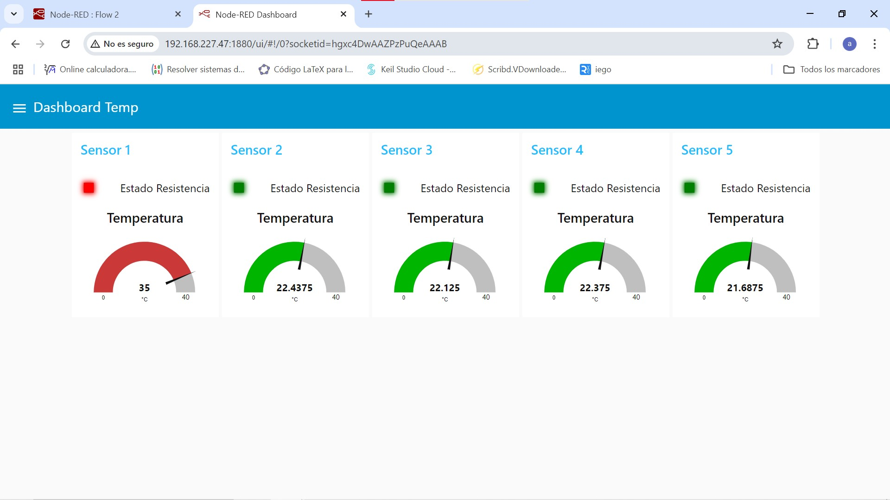
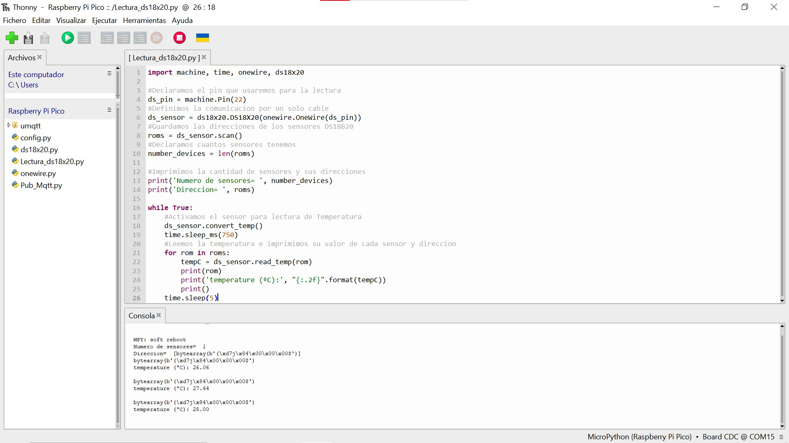
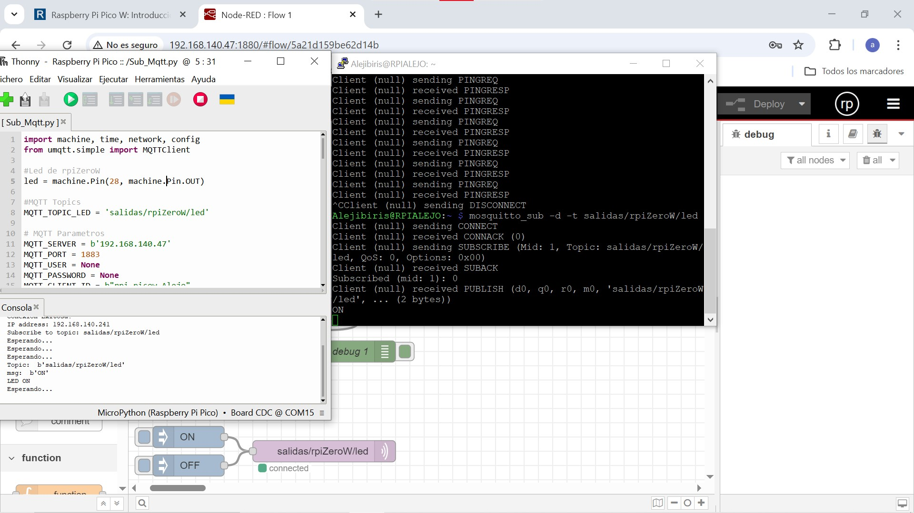
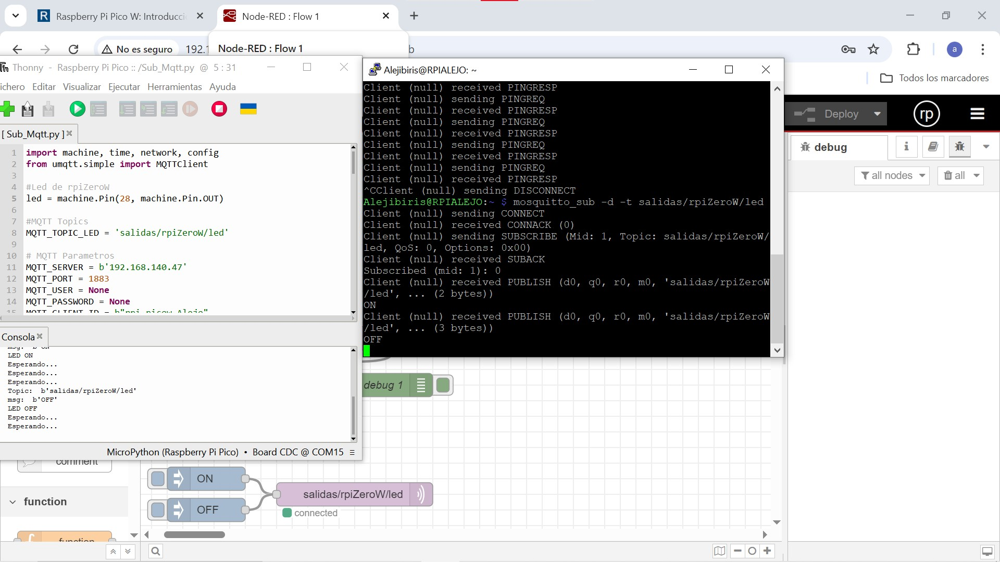
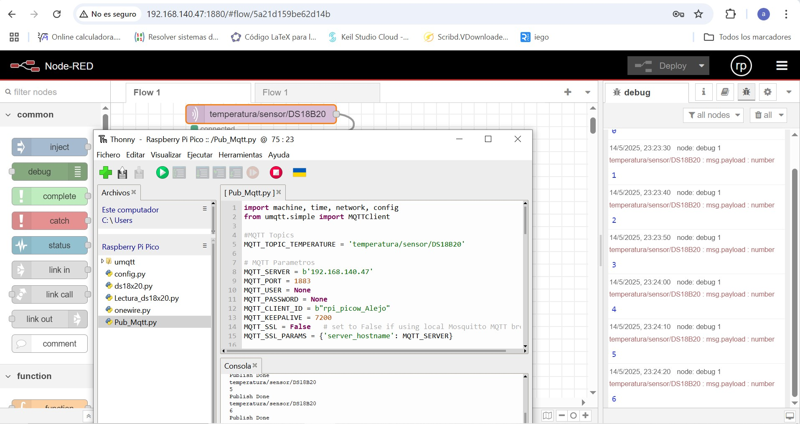

# Lab06: Proyecto 2da Entrega - Control de Temperatura para Mezclador de Pinturas

## 👥 Integrantes

| Integrantes                   |
|------------------------------|
| [`Diego Lopez`][Alejo]        |
| [`Daniel Ramirez`][Daniel]    |
| [`Sebastian Martinez`][Sebas] |

---

## 📘 Descripción general

Esta entrega contiene la segunda entrega del proyecto integrador para el laboratorio 06 del curso Sistemas Digitales 3 en la Universidad ECCI. El proyecto se centra en la implementación de un sistema de control de temperatura para un **Mezclador de Pinturas**, utilizando tecnologías embebidas.

Este proyecto implementa un sistema distribuido para la adquisición y transmisión de temperaturas desde sensores DS18B20, con control remoto de resistencias usando el protocolo MQTT. El sistema está pensado para funcionar con una Raspberry Pi Pico W como dispositivo de lectura y publicación de datos, y un segundo nodo receptor como puede ser una Raspberry Pi Zero W o cualquier otro cliente MQTT.

---

## 📂 Estructura del repositorio

- [`Codigos/`](https://github.com/ECCI-Sistemas-Digitales-3/lab06-proyecto-2da-entrega-g4/tree/main/Codigos) Contiene los códigos fuente en **Micropython** que implementan la lógica del control de temperatura y comunicación MQTT para el mezclador de pinturas.

- [`Imagenes/`](https://github.com/ECCI-Sistemas-Digitales-3/lab06-proyecto-2da-entrega-g4/tree/main/Imagenes) Diagramas, capturas y recursos visuales relacionados con el proyecto.

- [`flows.json`](https://github.com/ECCI-Sistemas-Digitales-3/lab06-proyecto-2da-entrega-g4/blob/main/flows.json) Archivo de configuración para simulaciones o flujos relacionados.

## 📂 Estructura de Archivos de codigo

| Archivo                    | Descripción                                         |
|---------------------------|-----------------------------------------------------|
| [`Lectura_ds18x20.py`](https://github.com/ECCI-Sistemas-Digitales-3/lab06-proyecto-2da-entrega-g4/blob/main/Codigos/Lectura_ds18x20.py)       | Lectura básica de sensores DS18B20.                |
| [`Pub&Sub_Mqtt_ds18x20.py`](https://github.com/ECCI-Sistemas-Digitales-3/lab06-proyecto-2da-entrega-g4/blob/main/Codigos/Pub&Sub_Mqtt_ds18x20.py)  | Publicación de temperatura y recepción de comandos.|
| [`Pub_Mqtt.py`](https://github.com/ECCI-Sistemas-Digitales-3/lab06-proyecto-2da-entrega-g4/blob/main/Codigos/Pub_Mqtt.py)               | Publicación continua de valor simulado.            |
| [`Sub_Mqtt.py`](https://github.com/ECCI-Sistemas-Digitales-3/lab06-proyecto-2da-entrega-g4/blob/main/Codigos/Sub_Mqtt.py)               | Cliente MQTT que controla un LED según el mensaje. |
| [`ds18x20.py`](https://github.com/ECCI-Sistemas-Digitales-3/lab06-proyecto-2da-entrega-g4/blob/main/Codigos/ds18x20.py)                | Librería para sensores DS18B20.                    |
| [`onewire.py`](https://github.com/ECCI-Sistemas-Digitales-3/lab06-proyecto-2da-entrega-g4/blob/main/Codigos/onewire.py)                | Librería del protocolo 1-Wire.                     |

## 🧱 Componentes del Sistema
### 📡 Raspberry Pi Pico W (Nodo Sensor)

- Lectura de hasta 5 sensores DS18B20 mediante protocolo 1-Wire.

- Publicación de las temperaturas en distintos topics MQTT.

- Recepción de comandos desde MQTT para simular control de resistencias.

- Conexión Wi-Fi automática usando credenciales externas.

### 💻 Nodo Receptor (Broker + Cliente)

- Capacidad de enviar comandos de control a resistencias.

- Implementación demostrativa con encendido de LED como respuesta a mensajes.

---

## 🔧 Descripción técnica y códigos principales

### Uso de Micropython y librerías MQTT personalizadas

Micropython no incluye algunas librerías de Python estándar, por lo que fue necesario crear implementaciones propias o adaptadas para funciones clave, en especial para la comunicación MQTT, que es esencial para la telemetría y control remoto del sistema.

#### `simple.py`

- Implementa una versión básica del cliente MQTT para Micropython, basada en [micropython-lib/umqtt.simple](https://github.com/micropython/micropython-lib/tree/master/micropython/umqtt.simple).
- Contiene la lógica fundamental para conectar, publicar, suscribirse y recibir mensajes MQTT.
- Funciona con sockets básicos y maneja el protocolo MQTT en un entorno ligero.

#### `robust.py`

- Extiende la funcionalidad de `simple.py` para agregar robustez en la conexión MQTT.
- Implementa reconexiones automáticas y manejo de errores recurrentes en conexiones inestables, típico en redes IoT.
- Basado en [micropython-lib/umqtt.robust](https://github.com/micropython/micropython-lib/tree/master/micropython/umqtt.robust), con adaptaciones para este proyecto.
  
Estas librerías permiten que el dispositivo embebido mantenga comunicación confiable con el broker MQTT, facilitando el monitoreo y control remoto del sistema de temperatura del mezclador.

---

### Detalle adicional sobre uso y funcionalidad

Este proyecto utiliza MicroPython para controlar y monitorear sensores de temperatura DS18B20 en un sistema embebido, con comunicación vía MQTT para telemetría y control remoto.

El proyecto requiere adaptar librerías MQTT ligeras y personalizadas para el entorno restringido del microcontrolador, dado que MicroPython no incluye todas las librerías estándar de Python. Esto permite una comunicación confiable con un broker MQTT, fundamental para el monitoreo en tiempo real y el control remoto del sistema.

**Descripción de Scripts**

- `Lectura_ds18x20.py`  
  Gestiona la lectura de uno o varios sensores DS18B20 conectados a un pin específico, mostrando las temperaturas en consola. Adicionalmente para cada sensor se obtuvo la direccion.
  
- `Pub&Sub_Mqtt_ds18x20.py`  
  Combina la lectura de sensores con la publicación periódica de sus temperaturas a tópicos MQTT específicos. Además, se suscribe a tópicos de control para activar o desactivar resistencias eléctricas en el sistema, gestionando los mensajes recibidos.

- `Pub_Mqtt.py`  
  Ejemplo básico de publicación periódica de datos a un tópico MQTT, simula el envío de valores de temperatura. 

- `Sub_Mqtt.py`  
  Se suscribe a un tópico MQTT y controla un LED físico en función de los mensajes recibidos (encender o apagar).

- `config.py`  
  Contiene la configuración de red Wi-Fi para facilitar la conexión de los dispositivos embebidos.

**📊 Node-RED**

Para el monitoreo remoto del sistema de control de temperatura, se utilizó Node-RED como plataforma de visualización y control. A través de esta herramienta, se diseñó un panel interactivo donde se muestran las temperaturas en tiempo real obtenidas por los sensores DS18B20, y se controlan actuadores como LEDs o resistencias.

El flujo de Node-RED se conecta al broker MQTT para lectura y control. Esto permite una visualización clara del estado del sistema y facilita la interacción.

---

## 📲 Requisitos

- Raspberry Pi Pico W con MicroPython.
- Red Wi-Fi local.
- Broker MQTT.
- Cliente MQTT para suscribirse o enviar mensajes (Node-RED, MQTT Explorer, etc.).
- Sensores **DS18B20** conectados con resistencia de 4.7kΩ en el pin GPIO 22.

---

## 🧩 Funcionamiento General

Los dispositivos embebidos corren MicroPython y usan estas librerías para:

- Conectarse a una red Wi-Fi.
- Conectar y mantener sesión con un broker MQTT.
- Leer sensores de temperatura y publicar sus datos.
- Recibir comandos para controlar actuadores (resistencias, LED).
- Ejecutar acciones según comandos recibidos vía MQTT.

Este esquema facilita la creación de un sistema distribuido de monitoreo y control remoto, adaptable a distintas aplicaciones industriales o domóticas.

---

## 📌 Notas Importantes

- El código soporta hasta 5 sensores pero puede extenderse

- Las direcciones de los sensores se detectan automáticamente

- El sistema incluye manejo robusto de errores en conexiones

- Los tiempos de lectura y publicación son configurables

---

## 📊 Visualizacion de Datos

A continuación se presentan evidencias gráficas del funcionamiento del sistema de monitoreo y control de temperatura:

### 📊 Dashboard en Node-RED

Esta interfaz, desarrollada en Node-RED, permite visualizar en tiempo real las temperaturas captadas por los sensores DS18B20. Incluye medidores tipo *gauge*, indicadores LED y gráficas históricas por cada sensor. Las temperaturas se actualizan automáticamente cada 5 segundos mediante los mensajes MQTT recibidos.

---

### 🧪 Lectura de Temperatura en Terminal

Captura de la Raspberry Pi Pico W mostrando la lectura en consola de los 3 sensores DS18B20 conectados. Las temperaturas se expresan en grados Celsius con dos decimales de precisión. Esta lectura se realiza antes de publicar los datos por MQTT.

---

### 💡 Activación de LED por MQTT

 

Aquí se evidencia la respuesta del sistema al recibir un comando `ON` desde el tópico `salidas/rpiZeroW/led`. El LED conectado al pin 28 se activa, demostrando que el nodo receptor MQTT interpreta correctamente las órdenes remotas. Adicionalmente tambien recibe el comando `OFF`

---

### 🌐 Conexión Exitosa a Wi-Fi y Broker MQTT

Mensaje de consola confirmando la conexión exitosa a la red Wi-Fi y al broker MQTT. Esta etapa es esencial para garantizar la transmisión de datos entre nodos.

---

[Alejo]: <https://github.com/Alejibiris>  
[Daniel]: <https://github.com/D4N1EL-R4M1R3Z>  
[Sebas]: <https://github.com/SebasMtz30>  

